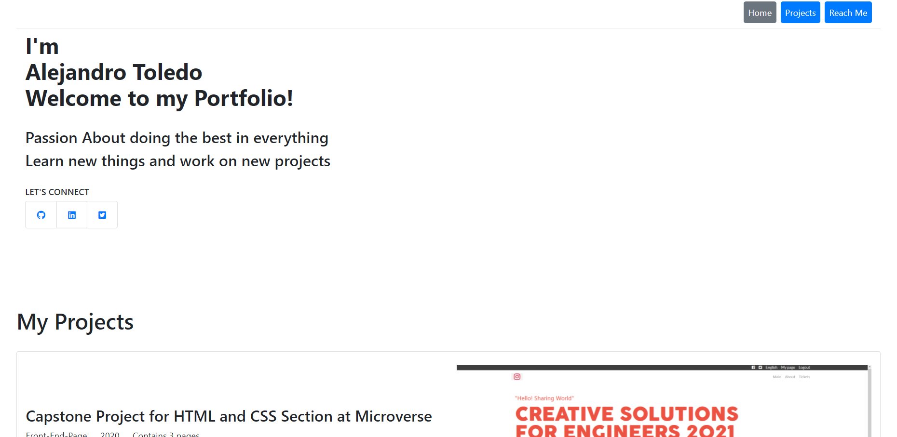

# Personal Portfolio

This repo contains my personal portfolio to show my personal project that I built.
Some of them I built during the time I was studying at Microverse School and other I build as my personal goals.

## Built With

 - HMTL
 - CSS
 - BOOTSTRAP

 ## Live Demo

[Click on this link to visit my portfolio](https://alejandrotoledoweb.github.io/Portfolio-template-1/#reach-me)

 ## Author

👤 **Alejandro Toledo**

- GitHub: [@alejandrotoledoweb](https://github.com/alejandrotoledoweb)
- Twitter: [@alejot](https://twitter.com/alejot) 
- LinkedIn: [Alejandro Toledo](https://www.linkedin.com/in/alejandro-toledo-3b444b109/) 

## 🤝 Contributing

Contributions, issues and feature requests are welcome!

Feel free to check the [issues page](issues/).

## Show your support

Give a ⭐️ if you like this project!

## 📝 License

This project is [MIT](https://opensource.org/licenses/MIT) licensed.

